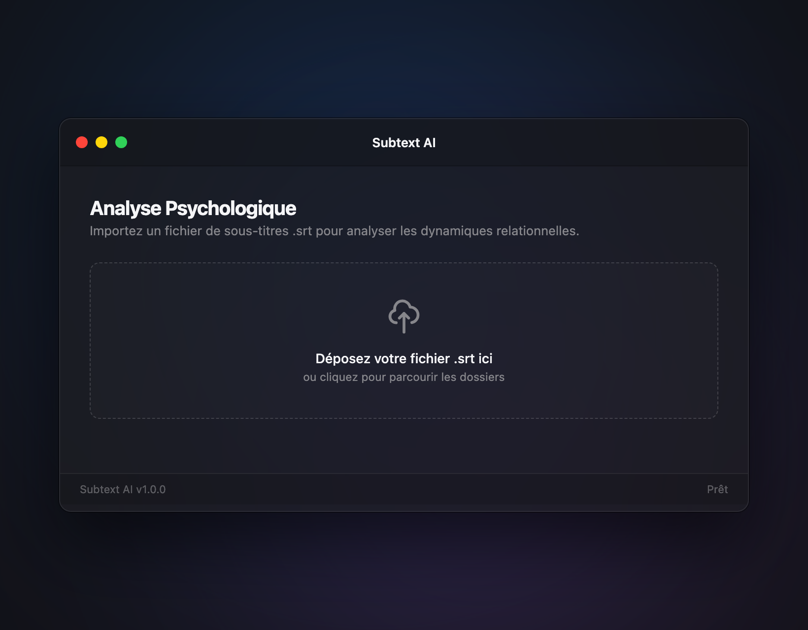
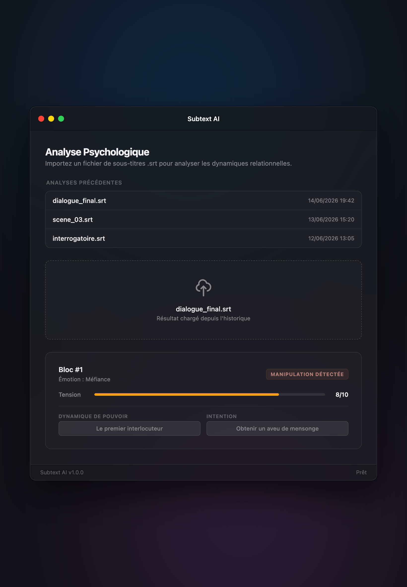

# Subtext AI

> Analyse psychologique et narrative de dialogues issus de fichiers de sous-titres (`.srt`), assistée par une IA **100 % locale**.

Subtext AI extrait les répliques d'un fichier de sous-titres, les regroupe en blocs contextualisés, puis les soumet à un modèle de langage local (via [Ollama](https://ollama.com/)) pour révéler le **sous-texte** d'une conversation : niveau de tension, émotion dominante, nature du conflit, rapports de pouvoir (qui domine, qui se justifie), intention réelle et tentatives de manipulation.

Aucune donnée n'est envoyée à un service externe : tout le traitement NLP s'effectue en local, sur `localhost:11434`.

---

## Objectif du projet

Fournir un outil d'aide à l'analyse de scénarios et de dialogues — utile en écriture, en étude de la communication ou en sciences humaines — qui transforme un simple fichier `.srt` en un **profil psychologique structuré** au format JSON, tout en garantissant la **confidentialité** (modèle local) et la **rapidité** (mise en cache des analyses déjà effectuées).

---

## Aperçu

### Écran d'accueil

Interface translucide façon macOS : importez (glisser-déposer ou clic) un fichier `.srt` pour lancer l'analyse.



### Résultat d'analyse & historique

Le profil psychologique s'affiche sous forme de carte (score de tension, émotion dominante, manipulation, dynamique de pouvoir, intention). La section **Analyses Précédentes** liste les analyses passées ; un clic les réaffiche instantanément depuis le cache, sans rappeler le modèle.



> *Captures réalisées sur l'interface réelle de l'application, avec des données d'exemple à des fins d'illustration.*

---

## Architecture technique

Flux de données d'une requête d'analyse :

```
   Fichier .srt
        │
        ▼
┌─────────────────┐    HTTP    ┌─────────────────────────────────────────┐
│   Navigateur    │ ─────────► │            Uvicorn (ASGI)                │
│  (UI / fetch)   │ ◄───────── │                  │                       │
└─────────────────┘    JSON    │                  ▼                       │
                               │            FastAPI (async)               │
                               │   1. Parsing SRT  ──►  chunks + overlap   │
                               │   2. Hash MD5 du contenu                  │
                               │                  │                        │
                               │                  ▼                        │
                               │        ┌───────────────────┐             │
                               │        │  SQLite (cache)    │             │
                               │        │  table `analyses`  │             │
                               │        └───────────────────┘             │
                               │            │           │                  │
                               │   cache hit│           │cache miss        │
                               │            ▼           ▼                  │
                               │       Résultat     Ollama (LLM local)     │
                               │       sauvegardé   llama3 @ :11434         │
                               └─────────────────────────────────────────┘
```

**En résumé :** `Uvicorn ➔ FastAPI ➔ Hash MD5 / SQLite ➔ Ollama`

- **Uvicorn** sert l'application ASGI.
- **FastAPI** orchestre le pipeline asynchrone : parsing du `.srt`, calcul de l'empreinte, consultation du cache, appel au modèle.
- **Hash MD5 + SQLite** assurent la persistance et évitent de relancer une analyse déjà connue.
- **Ollama** héberge le modèle `llama3` qui produit l'analyse.

### Structure du dépôt

```
subtext-ai/
├── app/
│   ├── main.py        # Application FastAPI : routes, cache, appel Ollama
│   ├── parser.py      # Nettoyage du SRT et découpage en chunks avec overlap
│   └── database.py    # Persistance SQLite asynchrone (cache + historique)
├── static/
│   └── index.html     # Interface web (HTML/CSS/JS, design translucide macOS)
├── requirements.txt
└── README.md
```

### Endpoints HTTP

| Méthode | Route       | Description                                                        |
|---------|-------------|-------------------------------------------------------------------|
| `GET`   | `/`         | Sert l'interface web.                                              |
| `POST`  | `/analyze`  | Analyse un fichier `.srt` (avec cache par hash de contenu).        |
| `GET`   | `/history`  | Liste des analyses précédentes (plus récente d'abord).            |
| `GET`   | `/health`   | Sonde de disponibilité.                                            |

---

## Fonctionnalités clés

### Cache par hash MD5 du contenu

Avant tout appel au modèle, le contenu brut du fichier est condensé en une empreinte **MD5** (`hashlib.md5(file_bytes)`). Cette empreinte sert de clé d'indexation en base :

- Deux fichiers au **contenu identique** — même renommés — partagent le même hash : l'analyse est servie **instantanément** depuis SQLite, sans solliciter Ollama.
- Deux fichiers **homonymes mais différents** produisent des hash distincts et sont donc analysés séparément.

Chaque réponse signale son origine via le drapeau `cached` (et `cached_at` pour la date d'origine).

### Few-Shot Prompting

L'appel au modèle ne se contente pas d'une consigne : il fournit un **exemple résolu** (dialogue → JSON attendu) en plus d'un *system prompt* détaillé. Ce conditionnement *few-shot* :

- impose un **format de sortie JSON strict** (clés et types constants) ;
- guide le modèle vers une analyse plus profonde, en explicitant les axes attendus : **domination** (qui pose les questions / mène l'échange), **intention** (déduite des verbes d'action et de volonté), **type de conflit** et **détection de manipulation**.

Le découpage du SRT applique par ailleurs un **overlap** (recouvrement de répliques entre blocs successifs) pour préserver la continuité narrative soumise au modèle.

### Interface Glassmorphism

Le frontend (`static/index.html`) adopte un design **translucide façon macOS** : fenêtre à fond flouté (*backdrop-filter*), typographie système `-apple-system`, fenêtre à **hauteur dynamique**, et une section **Historique** épurée. Au chargement, l'UI interroge `GET /history` ; un clic sur une entrée réaffiche **instantanément** le résultat stocké, sans nouvel appel au modèle.

---

## Installation

### Prérequis

- **Python 3.11+**
- **[Ollama](https://ollama.com/)** installé et lancé localement, avec le modèle `llama3` :

```bash
ollama pull llama3
ollama serve            # expose l'API sur http://localhost:11434
```

### Mise en place

```bash
# 1. (Recommandé) Créer et activer un environnement virtuel
python3 -m venv .venv
source .venv/bin/activate        # Windows : .venv\Scripts\activate

# 2. Installer les dépendances
pip install -r requirements.txt

# 3. Lancer le serveur de développement
uvicorn app.main:app --reload
```

L'application est alors disponible sur **http://localhost:8000**. La base SQLite (`subtext.db`) est créée automatiquement au premier démarrage.

> **Dépendances** : `fastapi`, `uvicorn`, `httpx`, `python-multipart`.

---

## Perspectives & choix techniques

- **Pipeline entièrement asynchrone** : FastAPI + `httpx.AsyncClient` pour l'appel au modèle ; les accès SQLite (bibliothèque standard, synchrone) sont délégués à un thread via `asyncio.to_thread` afin de ne jamais bloquer la boucle d'événements.
- **Gestion robuste des erreurs HTTP** : chaque mode de défaillance renvoie un code explicite plutôt que de faire planter le serveur —
  - `400` fichier vide, mauvaise extension ou encodage non-UTF-8,
  - `422` fichier SRT mal formé,
  - **`503`** Ollama injoignable (service non démarré),
  - **`504`** Ollama ne répond pas dans le délai imparti.
  
  Si le modèle renvoie un JSON invalide, la réponse est **dégradée proprement** (HTTP 200 avec `format_valid: false`) au lieu d'une erreur serveur.
- **Modèles locaux** : aucune API payante ni dépendance cloud. Le choix du modèle (`llama3`) et de l'URL Ollama est centralisé dans `app/main.py` et peut être adapté à d'autres modèles locaux (Mistral, etc.).

### Pistes d'évolution

- Analyse de **tous les blocs** d'un fichier (la V1 n'analyse que le premier chunk).
- Migration de SQLite vers **PostgreSQL** pour un déploiement multi-utilisateurs.
- Streaming des réponses du modèle et indicateur de progression côté UI.

---

*Projet académique — Subtext AI · Backend Python (FastAPI) · IA locale via Ollama.*
